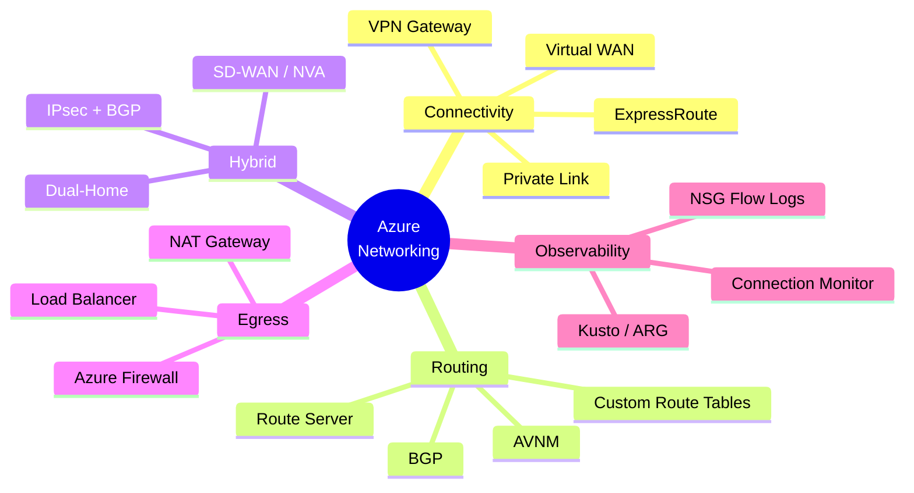

# Hi, I'm Adam 👋

### Senior Customer Engineer @ Microsoft · Azure Networking Specialist

---

## 🧭 About Me

I'm a Senior Customer Engineer at Microsoft focused on **Azure networking** — helping enterprises design hub-and-spoke, Virtual WAN, ExpressRoute, hybrid connectivity, and SD-WAN integrations. This profile is where I share **hands-on labs**, **architecture articles**, and **troubleshooting toolkits** I've built while working with customers.

- 🔭 Currently exploring → **AVNM Part Two**, **ExpressRoute monitoring**, **routing intent with forced tunneling**
- 🧪 I learn best by building — almost every article here has a runnable lab behind it
- 💬 Ask me about → vWAN custom routing, ExR Fastpath, ARS dual-home, BGP-over-IPsec, NAT GW
- 😎 *Check out the engineers I follow — they're much smarter than me and publish stellar Azure content*

## 🛠️ Tech Stack

## 🗺️ My Azure Networking Focus

## 📊 GitHub Stats

## 🧪 Labs

| Category | Lab | What's Inside |
|---|---|---|
| 🌐 **vWAN** | [BGP over IPSec](https://github.com/adtork/Lab-Virtual-Wan-Custom-Routing-BGP-over-IPSEC) | Custom vHub routing with Cisco CSR branch over IPsec + BGP, with `rt_yellow` / `rt_blue` route table isolation |
| 🧭 **AVNM** | [Azure Virtual Network Manager](https://github.com/adtork/Lab-Azure-Virtual-Network-Manager) | Walk-throughs for Mesh, Hub-and-Spoke, and Hub-and-Spoke + Global Mesh |
| 🧭 **AVNM** | [AVNM Part Two](https://github.com/adtork/AVNM-Part-Two) | Advanced AVNM scenarios *(work in progress)* |
| 🛣️ **ARS** | [Route Server Dual Home](https://github.com/adtork/Azure-Route-Server-Dual-Home) | Highly available ARS across two hubs with BGP + VNet-to-VNet IPsec |

## 📝 Articles

### ExpressRoute & Virtual WAN

| Article | TL;DR |
|---|---|
| [ExR Fastpath](https://github.com/adtork/ExpressRoute-Fastpath) | When to use Fastpath and exactly what it bypasses |
| [MSEE Hairpin Design Alternatives](https://github.com/adtork/MSEE-Hairpin-Design-Considerations) | How to avoid the classic MSEE hairpin |
| [vWAN-to-vWAN Connection Options](https://github.com/adtork/vWAN-to-vWAN-Connection-Options) | Patterns for connecting multiple vWANs |
| [vWAN with ExR Bow-Tie + HRP](https://github.com/adtork/vWAN-Dual-Hubs-with-ExR-Bow-Tie) | Dual-hub bow-tie with high-redundancy paths |
| [vWAN Routing Intent + Forced Tunneling](https://github.com/adtork/vWAN-Routing-Intent-with-Forced-Tunneling) | Securing internet egress with routing intent |
| [What is this ExR IP?](https://github.com/adtork/ExpressRoute--What-is-this-IP-) | Demystifying the IPs you see on ExR resources |
| [vWAN Traffic Flow Patterns](https://github.com/adtork/vWAN-Traffic-Flow-Scenarios) | Common end-to-end traffic flows through vWAN |
| [ExR Monitoring & Best Practices](https://github.com/adtork/ExpressRoute-Monitoring) | *(coming soon)* monitoring guidance |

### Networking Fundamentals

| Article | TL;DR |
|---|---|
| [Network Perf in Azure](https://github.com/adtork/Azure-Networking-Performance) | Throughput, latency, and tuning levers |
| [Azure IP Addressing & SNAT](https://github.com/adtork/Azure-IP-Addressing-and-SNAT) | Subnet sizing, pseudo-VIP, and the 3 SNAT options |
| [Empty VNet Trick](https://github.com/adtork/Empty-Vnet-Trick) | Advertising indirect spoke routes to on-prem |

## 🔧 Tools & Snippets

| Tool | What It's For |
|---|---|
| [Simple Loop Scripts](https://github.com/adtork/Simple-Loop-Scripts) | NetCat / Curl / Wget / Test-NetConnection / PSPing loop scripts for connectivity troubleshooting |
| [ARG Kusto Queries](https://github.com/adtork/ARG-Kusto-Queries) | A growing catalog of KQL queries for Azure Resource Graph inventory |

## 🤝 Connect

---

*Thanks for stopping by!* ✨

